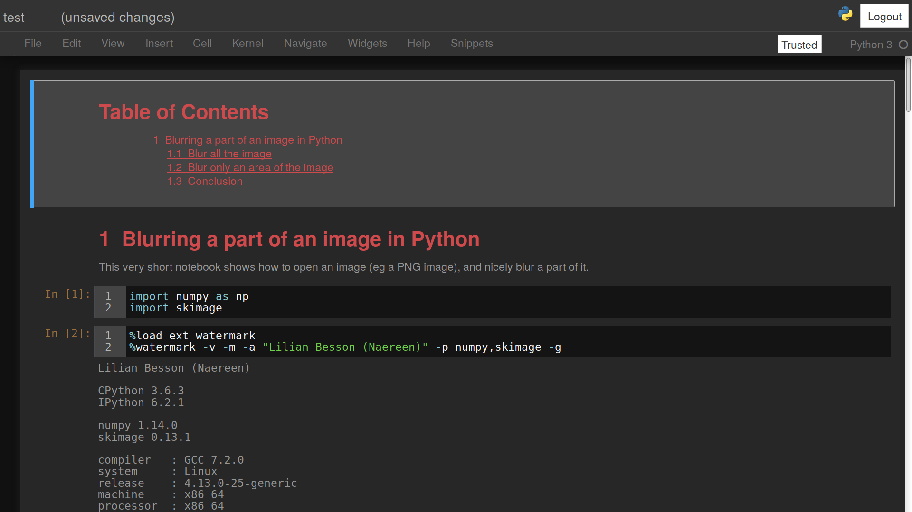
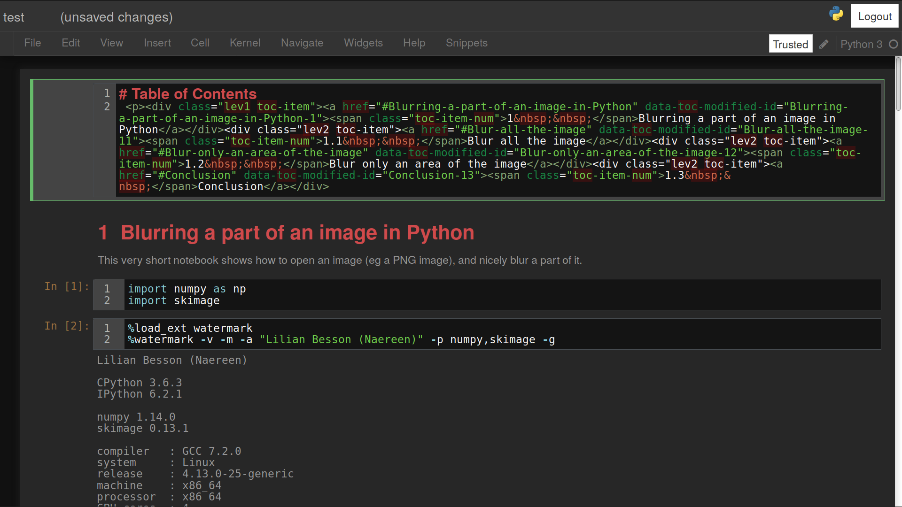
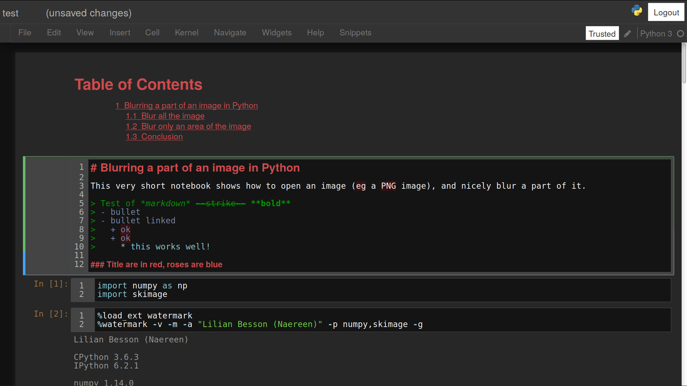
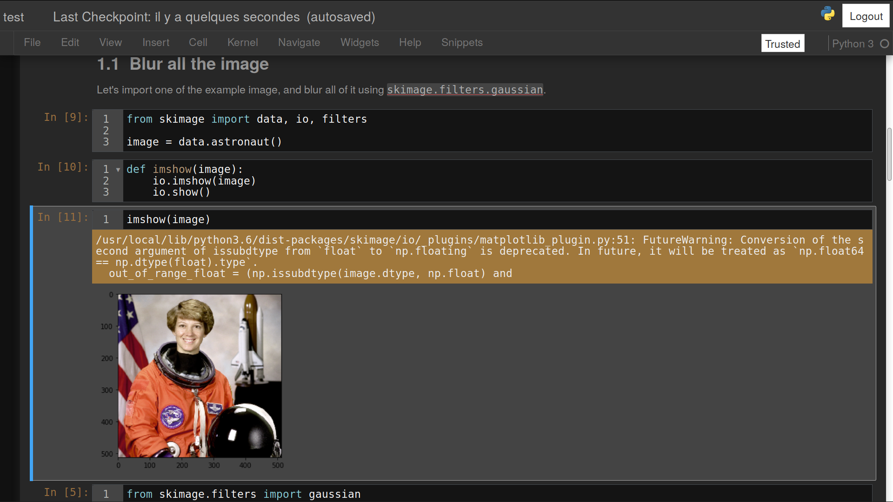
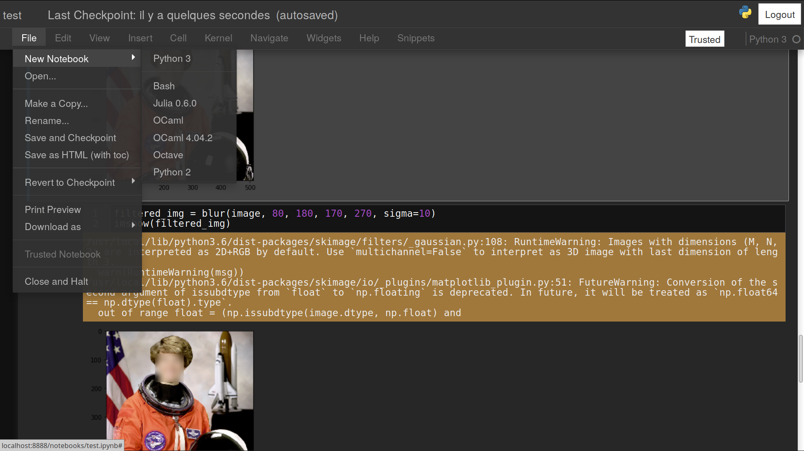

# Jupyter-Notebook - Dark Scheme

This is a completely dark theme for the [Jupyter Notebook](https://www.jupyter.org/) interface.

> Note: Source code coloring is based on the Twilight theme for Textmate. Print preview output for notebooks retains a white background with printable foreground colors.

## Installing
To install this theme, copy or symlink this file [`custom.css`](https://github.com/Naereen/Jupyter-Notebook-Atom-Scheme/raw/master/custom.css) into the folder `~/.jupyter/custom/`.

```bash
mkdir -p ~/.jupyter/custom/
cd ~/.jupyter/custom/
```

If needed, edit it as you wish:

```bash
nano custom.css
```

Then, whenever you run jupyter notebook (for Python or [other languages](https://github.com/jupyter/jupyter/wiki/Jupyter-kernels)) it will use this theme.

You can try [with the test notebook](test/test.ipynb).

## Screenshots
> Here are a few examples:












## Tips
Most of the coloring information can be modified after line 300.

> For more information on color code [see this website](http://html-color-codes.info/).


----

## :scroll: License ? [](https://github.com/Naereen/Jupyter-Notebook-Atom-Scheme/blob/master/LICENSE)
[MIT Licensed](https://lbesson.mit-license.org/) (file [LICENSE](LICENSE)).
© [Lilian Besson](https://GitHub.com/Naereen), 2018.

[](https://GitHub.com/Naereen/Jupyter-Notebook-Atom-Scheme/graphs/commit-activity)
[](https://GitHub.com/Naereen/ama)
[](https://GitHub.com/Naereen/Jupyter-Notebook-Atom-Scheme/)

[](https://GitHub.com/Naereen/)

[](https://ForTheBadge.com)
[](https://GitHub.com/)
[](https://ForTheBadge.com)

