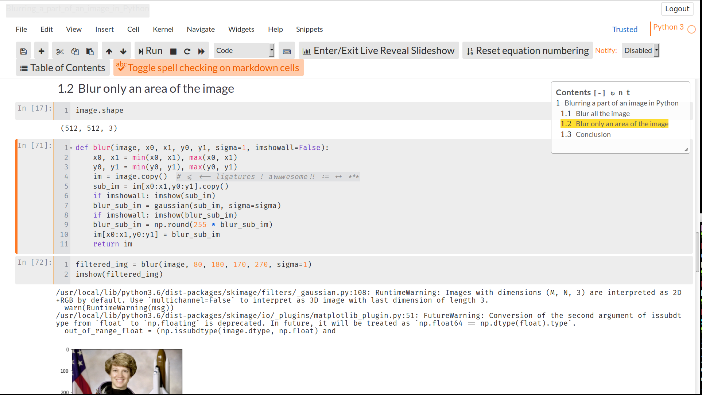
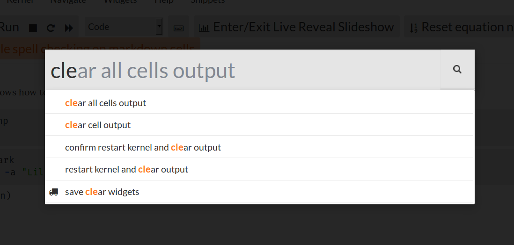
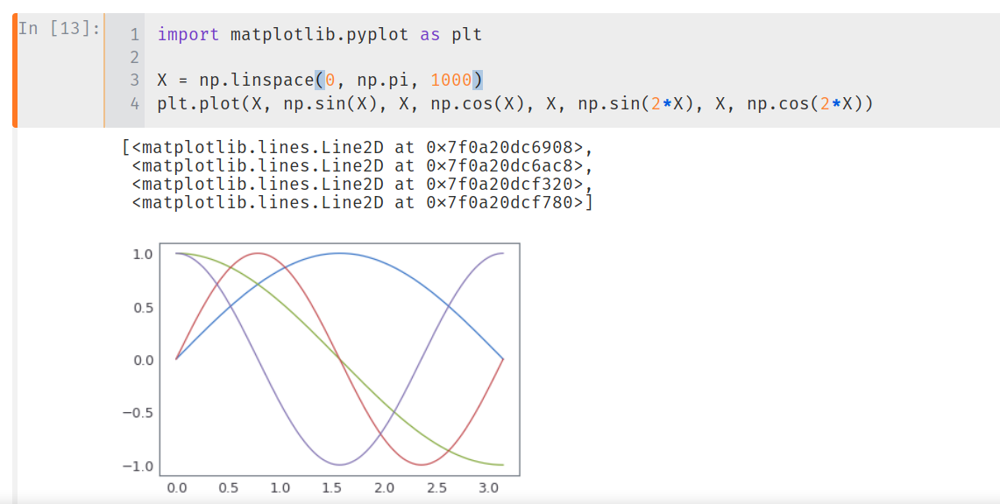
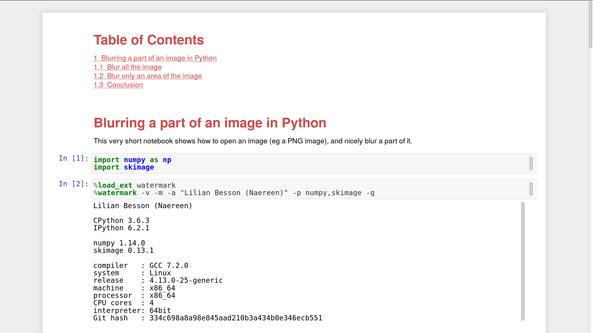

# :art: :dark_sunglasses: Jupyter-Notebook - Dark Scheme

> This ~~is~~ was a completely dark theme for the [Jupyter Notebook](https://www.jupyter.org/) interface.

## Actually... don't use this! Use [Jupyter-Themes](https://github.com/dunovank/jupyter-themes) instead!
[Jupyter-Themes](https://github.com/dunovank/jupyter-themes) is purely awesome :sparkles:!

Here is the theme I use:
```bash
$ jt -N -T -f firacode -tf loraserif -nf latosans -fs 95 -tfs 12 -nfs 115 -cellw 85% -t grade3
```

- It keeps the Name & Logo visible (`-N`),
- It keeps the Toolbar visible (`-T`),
- It uses the awesome [Fira Code](https://github.com/tonsky/FiraCode/) font for monospace font (code etc). Some ligatures are supported in [CodeMirror](https://codemirror.net/) (Jupyter's text editor), but not all,
- It uses the [Lora Serif](https://www.fontsquirrel.com/fonts/lora) and [Lato Sans](http://www.latofonts.com/lato-free-fonts/) fonts as serif and sans-serif fonts (I like them both),
- It uses a font-size of 95% (enough on large screen) (`-fs 95`),
- It uses a text font-size of 12pt and a notebook fontsize of 115% (increase text cells) (`-tfs 12 -nfs 116`),
- It reduces the cell width to 85% (`-cellw 85%`),
- And uses the other settings from the [grade3 theme](https://github.com/dunovank/jupyter-themes#grade3-syntax) (`-t grade3`).

It looks amazing :art: :sparkles:!






> Note: You can use [this `custom.css`](custom.css) file and [my `matplotlibrc`](matplotlibrc) file (to save in `~/.matplotlib/`) if you don't want to install [Jupyter-Themes](https://github.com/dunovank/jupyter-themes).

----

## Example


> Note: Source code coloring is based on the Twilight theme for Textmate. Print preview output for notebooks retains a white background with printable foreground colors.

## Installing
To install this theme, copy or symlink this file [`custom.css`](https://github.com/Naereen/Jupyter-Notebook-Atom-Scheme/raw/master/custom.css) into the folder `~/.jupyter/custom/`.

```bash
mkdir -p ~/.jupyter/custom/
cd ~/.jupyter/custom/
```

If needed, edit it as you wish:

```bash
nano custom.css
```

Then, whenever you run jupyter notebook (for Python or [other languages](https://github.com/jupyter/jupyter/wiki/Jupyter-kernels)) it will use this theme.

You can try [with the test notebook](test/test.ipynb).

## Screenshots
> Here are a few more examples:

Editing Markdown cells works fine:


The selected cell is dark gray (and not white, that was my reason to fork [this initial project](https://github.com/AlexandreRobicquet/Jupyter-Notebook-Atom-Scheme)):


The menus have all joined the dark side also:


Print preview still has the normal style with white background:



## Tips
Most of the coloring information can be modified manually. Just try to stay consistent!

> For more information on color code [see this website](http://html-color-codes.info/).

----

## :scroll: License ? [](https://github.com/Naereen/Jupyter-Notebook-Atom-Scheme/blob/master/LICENSE)
[MIT Licensed](https://lbesson.mit-license.org/) (file [LICENSE](LICENSE)).
© [Lilian Besson](https://GitHub.com/Naereen), 2018.

[](https://GitHub.com/Naereen/Jupyter-Notebook-Atom-Scheme/graphs/commit-activity)
[](https://GitHub.com/Naereen/ama)
[](https://GitHub.com/Naereen/Jupyter-Notebook-Atom-Scheme/)

[](https://GitHub.com/Naereen/)

[](https://ForTheBadge.com)
[](https://GitHub.com/)
[](https://ForTheBadge.com)

